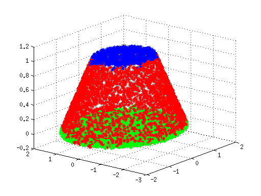

# npmcm15B
solution code for the 'National Postgraduate Mathmetic Contest in Modeling' 15 question B

with my teammate <a href='https://github.com/jojzhou' target='_blank'>@jojzhou</a> and <a href='https://github.com/tdktdkett' target='_blank'>@tdktdkett</a>

